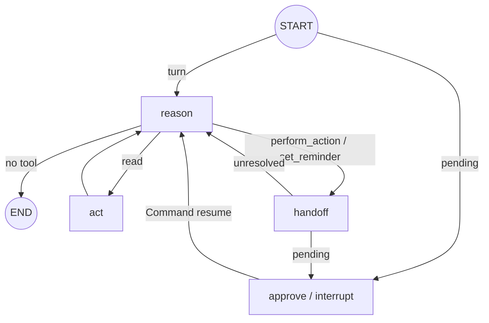
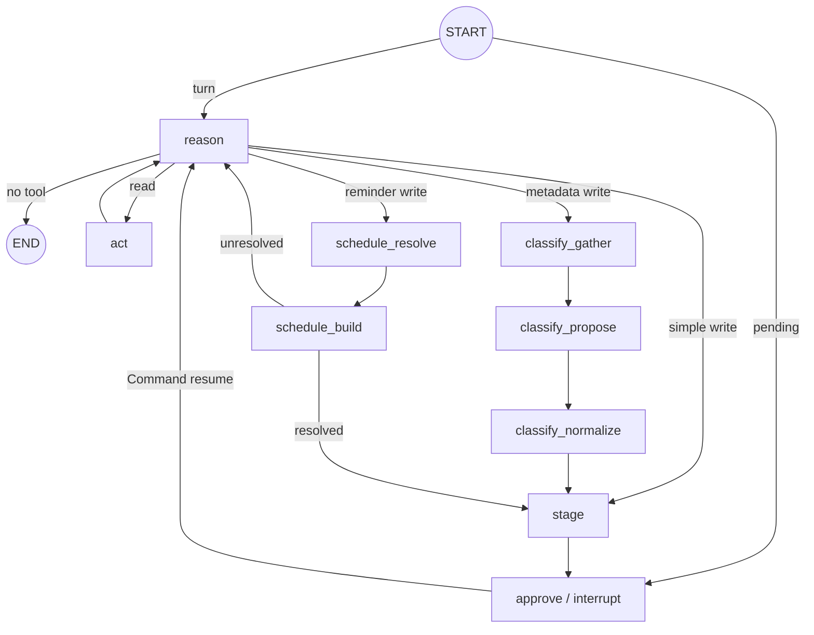

# Agent workflows on LangGraph

Status: **implemented.** Conversation and Enrich use compiled LangGraph
`StateGraph` workflows. Knowledge is a Conversation capability and Reminder is
an Enrich capability; neither is a separately registered agent.
Existing API response shapes remain unchanged.

## Persistence boundary

`PostgresSaver` is the execution-state source of truth. Each graph uses a scoped
thread id (`chat:<id>` or `enrich:<id>`), checkpoints every node boundary, and
resumes failures from the last successful node. The saver schema is installed
by API startup.

`chat_threads.messages` and `chat_threads.pending` remain an application
projection for ownership checks, API/UI reads, and evaluation. They no longer
decide which workflow node resumes. State contains only serializable data;
runtime tool contexts are reconstructed inside nodes with strict checkpoint
deserialization enabled.

## Chat graph

`ChatState` carries provider messages, per-turn context, step count, current tool
call, terminal response, pending action, specialist identity, and an ordered
cross-turn `reference_notes` list. Response citations remain turn-local.

The loop is four role-named nodes — `reason`, `act`, `handoff`, `approve` — each a
module under `nodes/` with a single public `run`. A single `handoff` node routes
every write/reminder request to its owning specialist: the tool name maps to a
specialist mode via `HANDOFF_SPECIALIST` (`perform_action`→enrich,
`set_reminder`→reminder), so a new capability is a map entry plus a tool spec, not
a new node. The old `pre_route` fast path is gone: its regex now lives in a
`detect_reminder` read tool the model can call to classify a message cheaply (no
model turn) before choosing `set_reminder`. The former `final` node is folded into
`reason`: once the read step budget is spent, `reason` makes one tool-free call so
it must answer.

`handoff` plans through Enrich for both modes; `reminder` names a mode, not a
separately registered agent. `approve` interrupts with the stable action id and
proposal. The confirm API uses `Command(resume=approve)`, so planning nodes are
not rerun. After approval, the node executes through Enrich. Old projections also
default to Enrich.

## Enrich graphs

`EnrichState` carries messages, context, step count, tool call, terminal state,
pending write, and confirmation flags. Every node is a module under `nodes/` with
a single public `run`: the loop primitives `reason`/`act`/`plan`/`approve` are
flat; the multi-step phases live in subpackages `classify/` (gather → propose →
normalize), `schedule/` (resolve → build), and `write/` (link, stage, validate).
`reason` folds in the old `final` node (a tool-free call once the budget is
spent).

`link_notes` first runs `link_context` (candidate lookup) before `stage`. The
stateless Chat handoff uses `ACTION_PLAN_GRAPH`:
`START -> plan -> act -> plan ... -> validate_write -> END`. It can read note
context, paths, and tags, but only returns a validated write proposal. The
handoff itself is typed and includes conversation and entities.

## Reminder capability

The main Enrich graph and `REMINDER_PLAN_GRAPH` both use
`schedule_resolve -> schedule_build`. The resolve node fixes the
natural-language time; build uses deterministic domain logic to resolve
referenced notes and return a frozen `create_reminder` proposal. The standalone
plan graph is used for Chat handoff evaluation and has no loop, checkpoint, or
independent approval boundary.
Telegram keeps its previous local
reminder detection, creation, delivery, claiming, list, cancel, and snooze logic.

## Invariants

- Chat has no direct write handler.
- Every Chat write requires explicit confirmation.
- Enrich owns all confirmed writes, including reminders.
- Agent chat-completion calls go through `agents/runtime/model_gateway.py`.
- Tool selection is single-call and loops are bounded.
- Reminder attachment is scoped by both note id and user id.
- Existing `/api/chat` and `/api/chat/confirm` contracts are unchanged.
