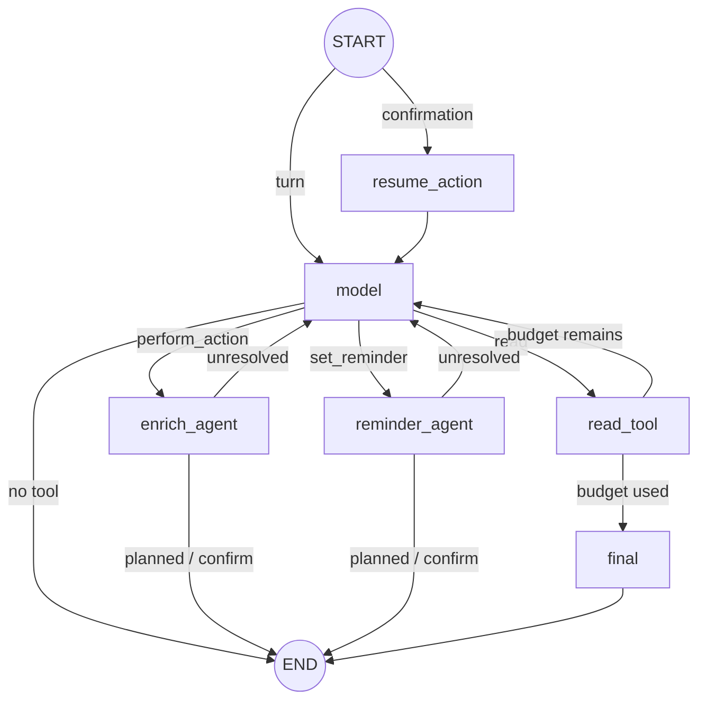
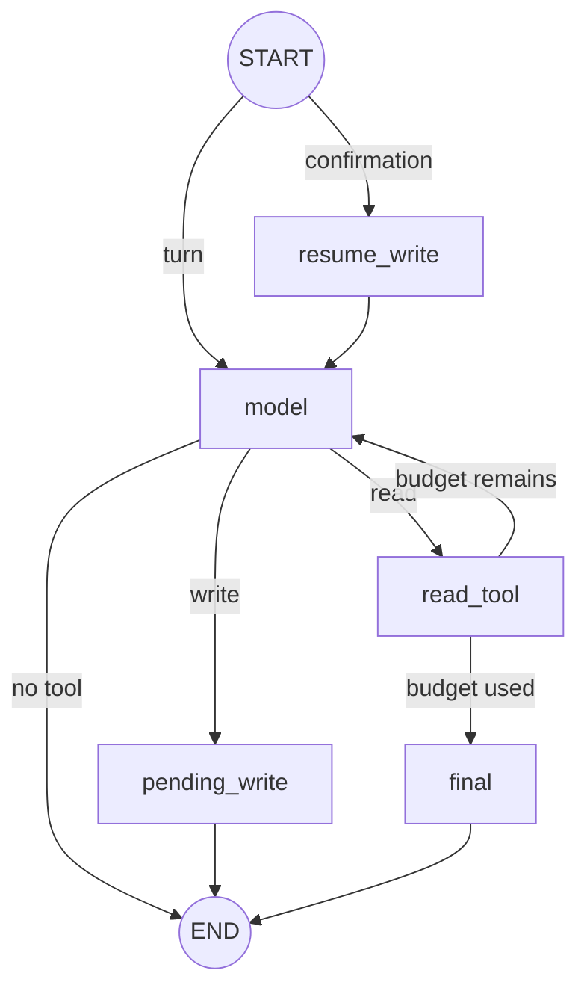
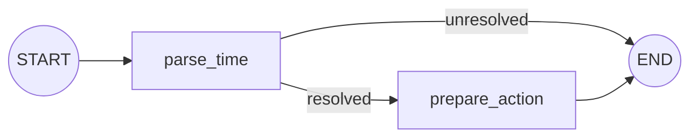

# Agent workflows on LangGraph

Status: **implemented.** Chat, Enrich, and Reminder use compiled LangGraph
`StateGraph` workflows. Existing API shapes and PostgreSQL thread persistence
remain unchanged.

## Persistence boundary

LangGraph owns orchestration within one request. `chat_threads.messages` and
`chat_threads.pending` remain the durable checkpoint across HTTP requests. A
second LangGraph checkpointer is intentionally not configured, avoiding two
competing sources of persisted truth.

## Chat graph

`ChatState` carries provider messages, per-turn context, step count, current tool
call, terminal response, pending action, specialist identity, and confirmation
resume flags.

`resume_action` dispatches to the specialist recorded in `pending.agent`; an
absent value defaults to Enrich for old checkpoints.

## Enrich graphs

`EnrichState` carries messages, context, step count, tool call, terminal state,
pending write, and confirmation flags.

The stateless Chat handoff uses `ACTION_PLAN_GRAPH`:
`START -> plan_action -> END`, restricted to Enrich write schemas.

## Reminder graph

`ReminderState` carries the verbatim instruction, caller-local `now`, parsed
`remind_at`, and proposed action.

`parse_time` uses a cheap multilingual hint gate followed by structured LLM
extraction. `prepare_action` freezes the resolved ISO time before confirmation.
This graph is used only by the Web App chat. Telegram keeps its previous local
reminder detection, creation, delivery, claiming, list, cancel, and snooze logic.

## Invariants

- Chat has no direct write handler.
- Every Chat write requires explicit confirmation.
- Chat reminder interpretation/persistence is isolated from Enrich.
- Tool selection is single-call and loops are bounded.
- Reminder attachment is scoped by both note id and user id.
- Existing `/api/chat` and `/api/chat/confirm` contracts are unchanged.
