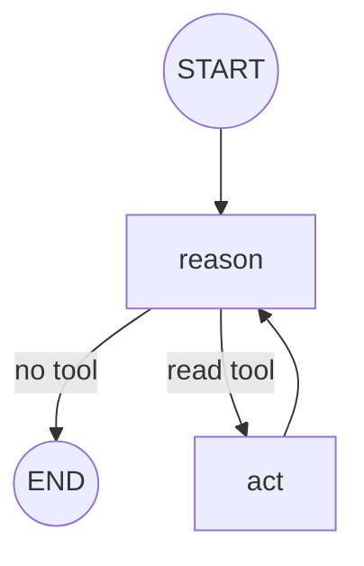
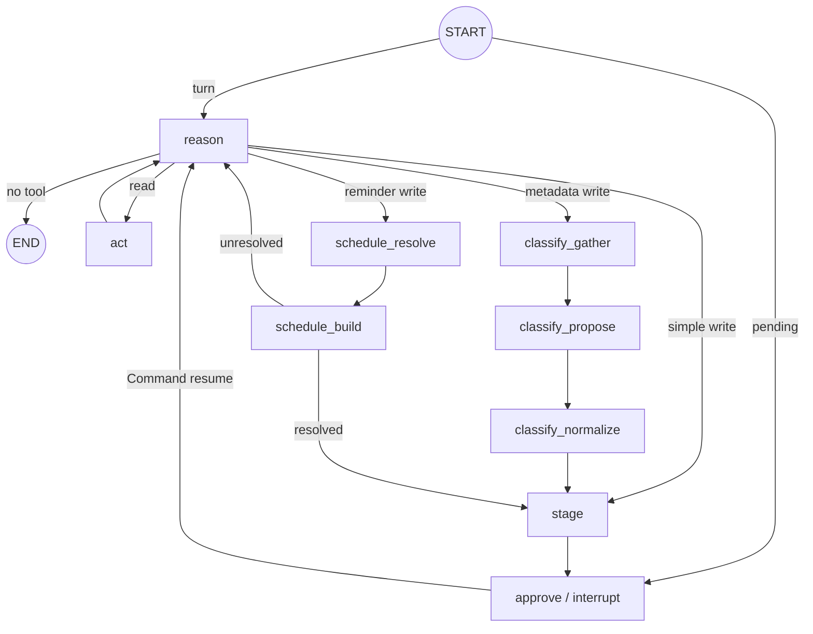

# Agent workflows on LangGraph

Status: **implemented.** Each agent that needs more than one model step compiles
its own `StateGraph`. The graphs are *inside* agents — how one agent does its
job. Who runs at all is the broker's (`devdoc/agent-broker.md`), and no graph
here routes to another agent.

## Persistence boundary

Two different things are persisted, and keeping them apart is the point.

`agent_states` (migration 0022) is the **turn tree**: one row per hop, written
by the broker, joined by `correlation_id`. It is what survives a suspend, what
`read_state` reads, and what the confirm path rebuilds the history from.

`PostgresSaver` is **execution state inside a graph that pauses**. Only the
agents that interrupt for approval need it — enrich and reminder — and they
resume through `Command(resume=…)` so planning nodes are not rerun. Finder never
pauses, so it compiles with an `InMemorySaver` and runs start to finish inside
one hop; checkpointing it would duplicate the `agent_states` row.

`chat_threads.messages` is an application projection owned by `api/chat_v2` — the
conversation transcript, appended by the section, not by any agent.

## Finder graph

A plain ReAct loop over read tools, with no pause and no handoff.

`reason` makes one tool-free call once the read budget (`AGENT_MAX_STEPS`) is
spent, so it must answer rather than loop. `act` runs one owner-scoped read and
records citations onto the turn context. The answer leaves in
`AgentResult.state` as `{answer, citations, trace}`; the responder relays it.

## Enrich graph

`EnrichState` carries messages, context, step count, tool call, terminal state,
pending write, and confirmation flags. Every node is a module under `nodes/`
with a single public `run`: the loop primitives `reason`/`act`/`plan`/`approve`
are flat; the multi-step phases live in subpackages `classify/` (gather →
propose → normalize), `schedule/` (resolve → build), and `write/` (link, stage,
validate). `reason` folds in the old `final` node (a tool-free call once the
budget is spent).

`link_notes` first runs `link_context` (candidate lookup) before `stage`.

`agents/enrich/agent.py` drives `ACTION_PLAN_GRAPH`
(`START -> plan -> act -> plan … -> validate_write -> END`) directly. That
graph reads note context, paths and tags and returns only a validated write
proposal; the agent then pauses the *turn* with `needs_input` and performs the
write itself on approval. The graph's own approval boundary is not used on
that path — the broker owns the pause.

## Reminder graph

`schedule_resolve -> schedule_build`. Resolve fixes the natural-language time;
build resolves referenced notes deterministically and returns a frozen
`create_reminder` proposal. Same shape as enrich's: plan here, pause in the
broker, write on approval.

Telegram keeps its own reminder detection, creation, delivery, claiming, list,
cancel and snooze logic in `api/telegram_bot` and does not use this graph.

## Invariants

- No graph routes to another agent; the broker does that.
- Every write requires explicit confirmation, and runs at most once
  (`execution_ledger`, keyed by the action's own fingerprint).
- Only the responder writes prose to the user.
- Agent chat-completion calls go through `agents/runtime/model_gateway.py`.
- Tool selection is single-call and loops are bounded.
- Reminder attachment is scoped by both note id and user id.
- Entering a compiled graph is `agents/runtime/loop.py`; `graph.py` only builds.
