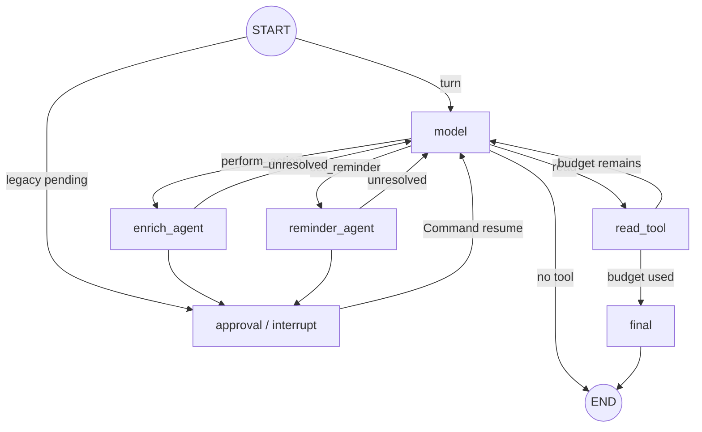
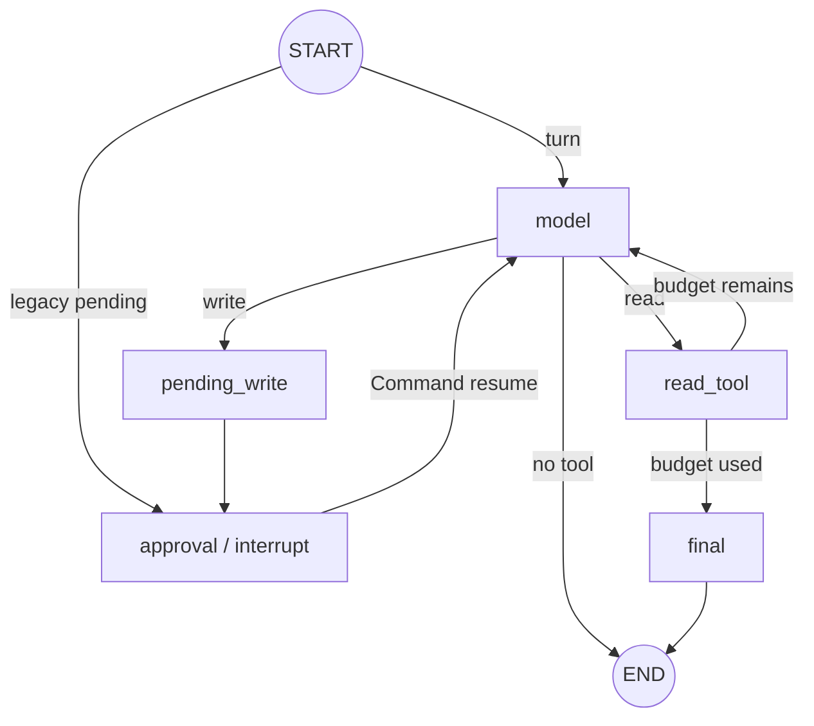
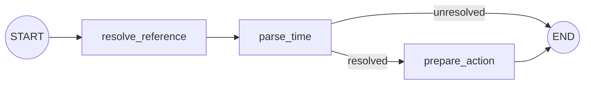

# Agent workflows on LangGraph

Status: **implemented.** Chat, Enrich, and Reminder use compiled LangGraph
`StateGraph` workflows with PostgreSQL checkpoints and native human interrupts.
Existing API response shapes remain unchanged.

## Persistence boundary

`PostgresSaver` is the execution-state source of truth. Each graph uses a scoped
thread id (`chat:<id>` or `enrich:<id>`), checkpoints every node boundary, and
resumes failures from the last successful node. The saver schema is installed
by API startup.

`chat_threads.messages` and `chat_threads.pending` remain an application
projection for ownership checks, API/UI reads, and evaluation. They no longer
decide which workflow node resumes. State contains only serializable data;
runtime tool contexts are reconstructed inside nodes with strict checkpoint
deserialization enabled.

## Chat graph

`ChatState` carries provider messages, per-turn context, step count, current tool
call, terminal response, pending action, specialist identity, and an ordered
cross-turn `reference_notes` list. Response citations remain turn-local.

`approval` interrupts with the stable action id and proposal. The confirm API
uses `Command(resume=approve)`, so planning nodes are not rerun. After approval,
the node dispatches to the specialist recorded in `pending.agent`; an absent
value defaults to Enrich for old projections.

## Enrich graphs

`EnrichState` carries messages, context, step count, tool call, terminal state,
pending write, and confirmation flags.

The stateless Chat handoff uses `ACTION_PLAN_GRAPH`:
`START -> plan_model -> plan_read -> plan_model ... -> validate_write -> END`.
It can read note context, paths, and tags, but only returns a validated write
proposal. The handoff itself is typed and includes conversation and entities.

## Reminder graph

`ReminderState` carries the typed handoff, resolved referenced-note text,
caller-local `now`, parsed `remind_at`, and proposed action.

`parse_time` uses a cheap multilingual hint gate followed by structured LLM
extraction. `prepare_action` freezes the resolved ISO time before confirmation.
This graph is used only by the Web App chat. Telegram keeps its previous local
reminder detection, creation, delivery, claiming, list, cancel, and snooze logic.

## Invariants

- Chat has no direct write handler.
- Every Chat write requires explicit confirmation.
- Chat reminder interpretation/persistence is isolated from Enrich.
- Tool selection is single-call and loops are bounded.
- Reminder attachment is scoped by both note id and user id.
- Existing `/api/chat` and `/api/chat/confirm` contracts are unchanged.
