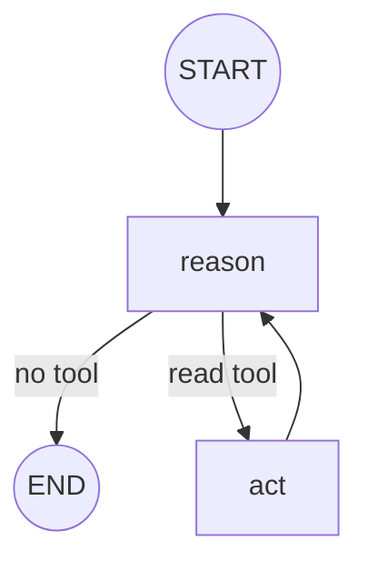
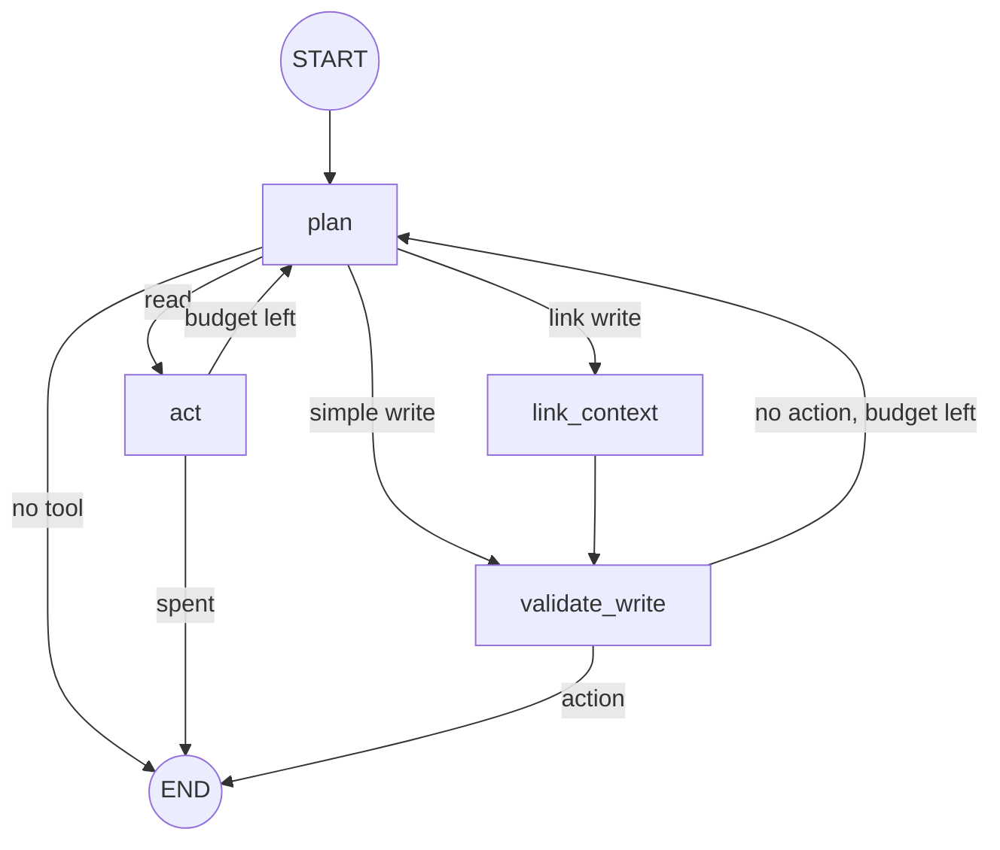
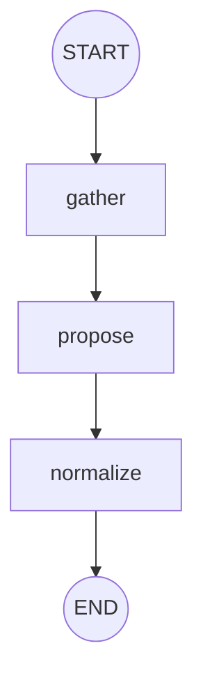

# Agent workflows on LangGraph

Status: **implemented.** Each agent that needs more than one model step compiles
its own `StateGraph`. The graphs are *inside* agents — how one agent does its
job. Who runs at all is the loop's (`devdoc/agent-loop.md`), and no graph
here routes to another agent.

## Persistence boundary

**Nothing about a turn is persisted by LangGraph.** No graph in this repo
compiles with a checkpointer, so no graph carries a `thread_id`, and the
library is used for what it is good at here: sequencing steps *within* one
agent hop, in memory, start to finish.

`agent_states` (migration 0022) is the **turn tree** and the only durable
record of a hop: one row per hop, written by the loop, joined by
`correlation_id`. It is what survives a suspend, what `read_state` reads, and
what the confirm path rebuilds the history from.

A **pause is the loop's**, not a graph's. An agent that wants to write returns
`needs_input` with the planned action serialised into a token; the section
stores it as `TurnOutcome.pending`, and `resume` performs the write once,
guarded by `action_executions`. No graph state is rehydrated, so no planning
node is rerun — the plan travelled in the token.

`chat_threads.messages` is an application projection owned by `api/chat_v2` — the
conversation transcript, appended by the section, not by any agent.

### What used to be here

`agents/runtime/checkpoint.py` wrapped a `PostgresSaver` and was called once at
API startup to create LangGraph's checkpoint tables. By the time it was deleted
nothing wrote to them: the enricher's interrupt graph was unreachable, the
reminder planned without a config, and the finder's `InMemorySaver` was handed a
fresh `thread_id` per turn — an entry per hop that nothing read and nothing
evicted. The tables were **left in the database** rather than dropped; they are
idle, and an irreversible `DROP` is not worth the tidiness.

Reintroducing durable checkpointing is a real option if an agent ever needs to
pause *mid-graph* rather than between hops. It would replace the action token,
not `agent_states`, and `git log` has the previous implementation.

## Finder graph

A plain ReAct loop over read tools, with no pause and no handoff.

```mermaid
flowchart TD
    S((START)) --> M[reason]
    M -->|no tool| E((END))
    M -->|read tool| T[act]
    T --> M
```

`reason` makes one tool-free call once the read budget (`AGENT_MAX_STEPS`) is
spent, so it must answer rather than loop. `act` runs one owner-scoped read and
records citations onto the turn context. The answer leaves in
`AgentResult.state` as `{answer, citations, trace}`; the responder relays it.

## Enricher graph

`ActionPlanState` carries messages, context, tool specs, step count, tool call
and the write proposal. Every node is a module under `nodes/` with a single
public `run`: `plan` and `act` are flat; the one multi-step phase left lives in
the `write/` subpackage (link, validate). `classify/` left with the nodes — see
the classifier graph below.

```mermaid
flowchart TD
    S((START)) --> P[plan]
    P -->|no tool| E((END))
    P -->|read| T[act]
    P -->|link write| L[link_context]
    P -->|simple write| V[validate_write]
    T -->|budget left| P
    T -->|spent| E
    L --> V
    V -->|action| E
    V -->|no action, budget left| P
```

`agents/enricher/agent.py` invokes `ACTION_PLAN_GRAPH` directly. The graph reads
note context, paths and tags and returns only a **validated write proposal** —
it performs no write and it never pauses. The agent then suspends the *turn*
with `needs_input`, and `resume` performs the write once the user approves.

There was a second graph here, `ENRICH_GRAPH`: an interactive capture loop whose
`approve` node paused on a LangGraph `interrupt`, resuming via
`Command(resume=…)`. It stopped being reachable when the farm's loop took over
the pause, stayed compiled at import for a while after, and has been deleted
along with its `reason`, `approve` and `stage` nodes. Two ways to pause is one
too many; `git log` has it.

A second graph has left this file since, for a related reason. `CLASSIFY_GRAPH`
offered the metadata pipeline as a standalone entry and was invoked by nothing
but a test — compiled at import, unreachable in production, exactly the shape
`ENRICH_GRAPH` had. It was not deleted: those three nodes are the classifier
agent now, so the graph became live instead.

## Classifier graph

`ClassifyState` carries the turn context, the note, the gathered vault context,
the raw proposal and the normalised metadata. Three nodes, no conditional
edges — filing is a fixed pipeline, so there is no `routing.py`:

```mermaid
flowchart TD
    S((START)) --> G[gather]
    G --> P[propose]
    P --> N[normalize]
    N --> E((END))
```

`gather` reads the note and the vault vocabulary it is filed against; `propose`
makes the one model call; `normalize` canonicalises the answer against the
user's localised root folders. Same shape as the other two write agents: the
graph plans, the loop pauses, `resume` writes on approval.

Why it is not an enricher phase any more: those nodes ran mid-plan, entered from
`after_plan` when the planner picked `enrich_note`, and had to thread their
working values through the planner's own state. As its own agent the pipeline
has one entry, one state and one subject, and the `metadata_` prefixes that kept
its keys apart from the planner's are gone with it.

## Reminder graph

`schedule_resolve -> schedule_build`. Resolve fixes the natural-language time;
build resolves referenced notes deterministically and returns a frozen
`create_reminder` proposal. Same shape as enricher's: plan here, pause in the
loop, write on approval.

Telegram keeps its own reminder detection, creation, delivery, claiming, list,
cancel and snooze logic in `api/telegram_bot` and does not use this graph.

## Invariants

- No graph routes to another agent; the loop does that.
- Every write requires explicit confirmation, and runs at most once
  (`execution_ledger`, keyed by the action's own fingerprint).
- Only the responder writes prose to the user.
- Agent chat-completion calls go through `agents/runtime/model_gateway.py`.
- Tool selection is single-call and loops are bounded.
- Reminder attachment is scoped by both note id and user id.
- `graph.py` only builds; the agent's `start`/`resume` enters the run with
  `GRAPH.invoke(state, graph_config)`. There is no wrapper around that call —
  one caller per graph made the indirection cost a name to read past.
