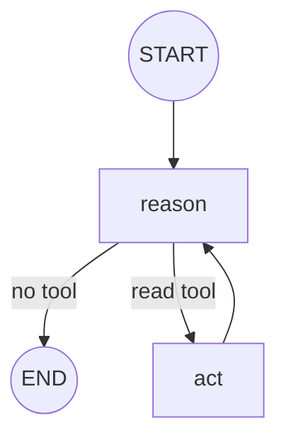
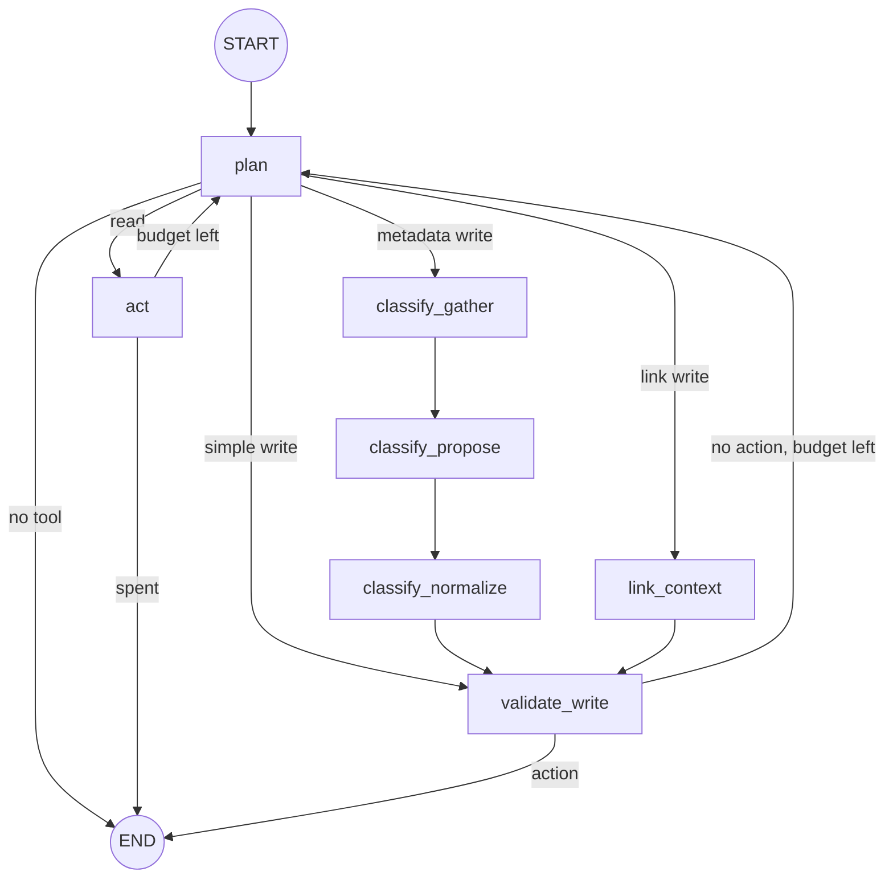

# Agent workflows on LangGraph

Status: **implemented.** Each agent that needs more than one model step compiles
its own `StateGraph`. The graphs are *inside* agents — how one agent does its
job. Who runs at all is the loop's (`devdoc/agent-loop.md`), and no graph
here routes to another agent.

## Persistence boundary

Two different things are persisted, and keeping them apart is the point.

`agent_states` (migration 0022) is the **turn tree**: one row per hop, written
by the loop, joined by `correlation_id`. It is what survives a suspend, what
`read_state` reads, and what the confirm path rebuilds the history from.

`PostgresSaver` is **execution state inside a graph that pauses**. Only the
agents that interrupt for approval need it — enricher and reminder — and they
resume through `Command(resume=…)` so planning nodes are not rerun. Finder never
pauses, so it **compiles with no checkpointer at all** and runs start to finish
inside one hop; checkpointing it would duplicate the `agent_states` row. It did
compile with an `InMemorySaver` for a while, against a fresh `thread_id` per
turn — an entry added to an in-process store on every hop that nothing read and
nothing evicted. Its run config now carries only a `recursion_limit`.

> This section still describes `PostgresSaver` as the pause mechanism. That is
> no longer true — the loop owns the pause, and nothing writes a checkpoint
> today. Correcting it is the next step of the cleanup that removed the finder's
> saver.

`chat_threads.messages` is an application projection owned by `api/chat_v2` — the
conversation transcript, appended by the section, not by any agent.

## Finder graph

A plain ReAct loop over read tools, with no pause and no handoff.

```mermaid
flowchart TD
    S((START)) --> M[reason]
    M -->|no tool| E((END))
    M -->|read tool| T[act]
    T --> M
```

`reason` makes one tool-free call once the read budget (`AGENT_MAX_STEPS`) is
spent, so it must answer rather than loop. `act` runs one owner-scoped read and
records citations onto the turn context. The answer leaves in
`AgentResult.state` as `{answer, citations, trace}`; the responder relays it.

## Enricher graph

`ActionPlanState` carries messages, context, tool specs, step count, tool call
and the write proposal. Every node is a module under `nodes/` with a single
public `run`: `plan` and `act` are flat; the multi-step phases live in
subpackages `classify/` (gather → propose → normalize) and `write/` (link,
validate).

```mermaid
flowchart TD
    S((START)) --> P[plan]
    P -->|no tool| E((END))
    P -->|read| T[act]
    P -->|metadata write| MC[classify_gather]
    P -->|link write| L[link_context]
    P -->|simple write| V[validate_write]
    T -->|budget left| P
    T -->|spent| E
    MC --> MM[classify_propose]
    MM --> MV[classify_normalize]
    MV --> V
    L --> V
    V -->|action| E
    V -->|no action, budget left| P
```

`agents/enricher/agent.py` invokes `ACTION_PLAN_GRAPH` directly. The graph reads
note context, paths and tags and returns only a **validated write proposal** —
it performs no write and it never pauses. The agent then suspends the *turn*
with `needs_input`, and `resume` performs the write once the user approves.

There was a second graph here, `ENRICH_GRAPH`: an interactive capture loop whose
`approve` node paused on a LangGraph `interrupt`, resuming via
`Command(resume=…)`. It stopped being reachable when the farm's loop took over
the pause, stayed compiled at import for a while after, and has been deleted
along with its `reason`, `approve` and `stage` nodes. Two ways to pause is one
too many; `git log` has it.

## Reminder graph

`schedule_resolve -> schedule_build`. Resolve fixes the natural-language time;
build resolves referenced notes deterministically and returns a frozen
`create_reminder` proposal. Same shape as enricher's: plan here, pause in the
loop, write on approval.

Telegram keeps its own reminder detection, creation, delivery, claiming, list,
cancel and snooze logic in `api/telegram_bot` and does not use this graph.

## Invariants

- No graph routes to another agent; the loop does that.
- Every write requires explicit confirmation, and runs at most once
  (`execution_ledger`, keyed by the action's own fingerprint).
- Only the responder writes prose to the user.
- Agent chat-completion calls go through `agents/runtime/model_gateway.py`.
- Tool selection is single-call and loops are bounded.
- Reminder attachment is scoped by both note id and user id.
- `graph.py` only builds; the agent's `start`/`resume` enters the run with
  `GRAPH.invoke(state, graph_config)`. There is no wrapper around that call —
  one caller per graph made the indirection cost a name to read past.
