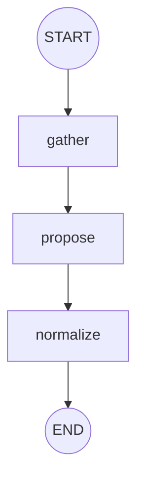

# The classifier agent

Files one existing note into the vault: type, title, folder path, tags and
priority, decided together in a single pass against the user's own vocabulary.

## Why it is its own agent

These three nodes used to be the enricher's `classify/` subpackage, entered
from `after_plan` when the planner picked the `enrich_note` tool and rejoining
at `validate_write`. That made them a sub-step of resolving one tool call
inside another agent's planning loop — the one shape the farm has no room for,
since routing between units of work is the loop's job and no graph may hold an
edge to another agent.

Splitting it out did three things at once:

- **A dead graph became live.** `CLASSIFY_GRAPH` already existed, compiled at
  import from `build_classify_graph()`, offering the pipeline as a standalone
  entry — and was invoked by nothing but a test. It is this agent's graph now.
- **The enricher shrank from seven nodes to four** (`plan`, `act`,
  `link_context`, `validate_write`) and lost a branch from `after_plan`.
- **The state stopped being a guest.** `metadata_text`, `metadata_note_id`,
  `metadata_context`, `metadata_error` and `metadata_trace` carried that prefix
  only to avoid colliding with the planner's keys in `ActionPlanState`. In a
  state whose only subject is a note's metadata they are `text`, `note_id`,
  `context`, `error`, `trace`.

## The graph

No conditional edges, so no `routing.py`: filing is a fixed pipeline.

- **gather** — reads the note (`get_note_context`) when the text is not already
  in hand, then the vault vocabulary it is filed against: `list_paths`,
  `list_tags`, `get_vault_context` and `find_related_notes` as classification
  precedent. Every call is traced with its latency. A tool error ends the
  pipeline with `error` set rather than raising.
- **propose** — the one model call, `response_format=json_object`. A failure
  here is deliberately not fatal: `normalize` fills canonical defaults from the
  note's own text, so the turn still produces a filing.
- **normalize** — deterministic. Canonicalises the path against the user's
  *localised* root folders and bounds title and tags. It no longer folds its
  result into a planner's `tool_call`; the agent owns the write, so building
  the action belongs to `agent.py`.

## The turn

`start` resolves which note is meant, runs the graph, and pauses:

1. `references.referenced_note_ids` — what the client named wins.
2. Otherwise `read_state` over the turn's earlier hops, taking a note a peer
   **wrote** before one the finder merely **cited**. After "save this and file
   it properly", "it" is the note the enricher's write just created.

Only the first candidate is used. Filing is per-note, and guessing a second
target would file a note the user never mentioned.

The action carries the metadata itself, not just the note id — `enrich_note`
refuses a proposal that arrives without approved values — so what the user
reads in the confirmation summary is exactly what `resume` writes.

`resume` executes the write and reports `Ref("note", id)`.

## Boundaries

- **Against the enricher.** The enricher changes what a note *says* or what it
  *connects to*: create, move, tag, link. The classifier decides all five
  metadata fields at once. `enrich_note` was *moved*, not copied — two ways to
  file a note would be two ways for the farm to disagree with itself. Both
  descriptions name what the other one does, because the router picks between
  them on that text alone. **This is the live risk in the split**: a blurred
  pair of descriptions sends filing to the enricher, which no longer has a tool
  for it.
- **Against the bot.** `api/telegram_bot` keeps its own one-shot
  `helper.enrich_note` behind the 🧠 Enrich button, with no agent and no
  confirmation. That duplication is deliberate, like the bot's own reminder
  detection.
- **Two confirms.** "Save this and file it" is now two paused writes — the
  enricher's, then the classifier's. That is the visible cost of keeping the
  pause, and the reason the second hop can find the first one's note at all is
  that `resume` re-enters the loop with routing still open.
